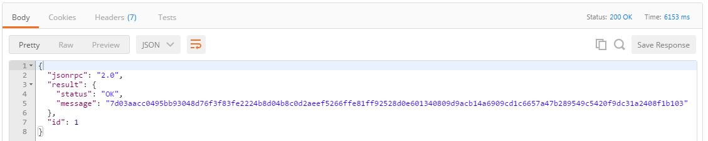
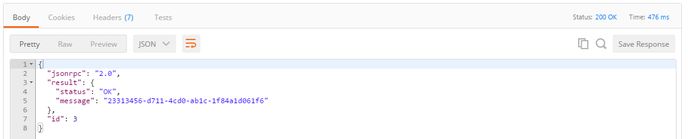

# Learn Chaincode

A tutorial to get you started with writing smart contracts for Hyperledger.

# Deployment

In order to support multiple versions of the Hyperledger fabric, this repository uses branches in combination with gopkg.in URLs. What does this mean for beginners? Just pick the branch below and use the instructions for that branch to complete the tutorial

## Versions and Supported Platforms

- [v1.0](https://github.com/ibm-blockchain/learn-chaincode/tree/v1.0)

  - Hyperledger fabric v0.5-developer-preview
  - IBM Bluemix Blockchain Service v0.4.2

- [v2.0](https://github.com/ibm-blockchain/learn-chaincode/tree/v2.0)

  - Hyperledger fabric v0.6-developer-preview
  - IBM Bluemix Blockchain Service v1.0.0

If you'd like to just deploy the sample code without completing the tutorial, then use the following URLs for the path parameter when deploying via the fabric REST API. Choose the URL that corresponds to the branch you are using above.

```
http://gopkg.in/ibm-blockchain/learn-chaincode.v1/finished
OR
http://gopkg.in/ibm-blockchain/learn-chaincode.v2/finished
```

# How to write chaincode

This tutorial demonstrates the basic building blocks and functionality necessary to build an elementary [Hyperledger fabric](https://gerrit.hyperledger.org/r/#/admin/projects/fabric) chaincode application. You will be incrementally building up to a working chaincode that will be able to create generic assets. Then, you will interact with the chaincode by using the network's API. After reading and completing this tutorial, you should be able to explicitly answer the following questions:

- What is chaincode?
- How do I implement the chaincode?
- What dependencies are required to implement chaincode?
- What are the major functions?
- How do I compile my chaincode?
- How do I pass different values to my arguments?
- How do I securely enroll a user on my network?
- How do I interact with my chaincode by using the REST API?

## What is chaincode?

Chaincode is a piece of code that is deployed into a network of [Hyperledger fabric](https://gerrit.hyperledger.org/r/#/admin/projects/fabric) peer nodes that enables interaction with that network's shared ledger.

--------------------------------------------------------------------------------

# Implementing Your First Chaincode

## Setting Up Your Development Environment

Before you get started, you should go [here](docs/setup.md) and build your chaincode development environment. When you come back, you'll have all the tools you need to get through this tutorial.

## Setting Up Your Development Pipeline

The following tasks take you through the process of building a pipeline that will allow you to build chaincode effectively. In short, your pipeline for iterating on chaincode will consist of the following steps:

- Make changes to the given chaincode on your local machine and check that the code compiles.
- Push your updates to GitHub.
- Deploy your updated chaincode to your local Hyperledger network using the fabric REST API.
- Test your chaincode using the fabric REST API.
- Repeat.

1. Fork this repository to your GitHub account. This can be accomplished quickly by scrolling up and clicking the __Fork__ button at the top of this repository.

  

  "Forking" the repository means creating a copy of this repository under your GitHub account. Note that the fork will fork the entire repository including all the branches. Toggle the __Branch__ button on the left to see the available branches.

  

2. Clone your fork into your $GOPATH.

  ```bash
  cd $GOPATH
  mkdir -p src/github.com/<YOUR_GITHUB_ID_HERE>/
  cd src/github.com/<YOUR_GITHUB_ID_HERE>/
  git clone -b v1.0 https://github.com/<YOUR_GITHUB_ID_HERE>/learn-chaincode.git
  OR
  git clone -b v2.0 https://github.com/<YOUR_GITHUB_ID_HERE>/learn-chaincode.git
  ```

  Now, you have a copy of your fork on your machine. You will develop your chaincode by making changes to these local files, pushing them to your fork on GitHub, and then deploying the code onto your blockchain network using the REST API on one of your peers.

3. Notice that we have provided two different versions of the chaincode used in this tutorial: [Start](start/chaincode_start.go) - the skeleton chaincode from which you will start developing, and [Finished](finished/chaincode_finished.go) - the finished chaincode.

4. Make sure it builds in your local environment:

  - Open a terminal or command prompt

  ```bash
  cd $GOPATH/src/github.com/<YOUR_GITHUB_ID_HERE>/learn-chaincode/start
  go build ./
  ```

  - It should compile with no errors/text. If not, make sure that you have correctly installed Go per the [development environment setup instructions](docs/setup.md).

5. Push the changes back to your fork on GitHub.

  ```bash
  cd $GOPATH/src/github.com/<YOUR_GITHUB_ID_HERE>/learn-chaincode/
  # See what files have changed locally.  You should see chaincode_start.go
  git status
  # Stage all changes in the local repository for commit
  git add --all
  # Commit all staged changes.  Insert a short description after the -m argument
  git commit -m "Compiled my code"
  # Push local commits back to https://github.com/<YOUR_GITHUB_ID_HERE>/learn-chaincode/
  git push
  ```

In order to turn a piece of Go code into chaincode, all you need to do is implement the chaincode shim interface. The three functions you have to implement are **Init**, **Invoke**, and **Query**. All three functions have the same prototype; they take in a 'stub', which is what you use to read from and write to the ledger, a function name, and an array of strings. The main difference between the functions is when they will be called. In this tutorial you will be building a chaincode to create generic assets.

### Dependencies

The `import` statement lists a few dependencies that you will need for your chaincode to build successfully.

- `fmt` - contains `Println` for debugging/logging.
- `errors` - standard go error format.
- `github.com/hyperledger/fabric/core/chaincode/shim` - contains the definition for the chaincode interface and the chaincode stub, which you will need to interact with the ledger.

### Init()

Init is called when you first deploy your chaincode. As the name implies, this function should be used to do any initialization your chaincode needs. In our example, we use Init to configure the initial state of a single key/value pair on the ledger.

In your `chaincode_start.go` file, change the `Init` function so that it stores the first element in the `args` argument to the key "hello_world".

```go
func (t *SimpleChaincode) Init(stub shim.ChaincodeStubInterface, function string, args []string) ([]byte, error) {
	if len(args) != 1 {
		return nil, errors.New("Incorrect number of arguments. Expecting 1")
	}

    err := stub.PutState("hello_world", []byte(args[0]))
    if err != nil {
        return nil, err
    }

    return nil, nil
}
```

This is done by using the stub function `stub.PutState`. The function interprets the first argument sent in the deployment request as the value to be stored under the key 'hello_world' in the ledger. Where did this argument come from, and what is a deploy request? All will be explained after we finish implementing the chaincode interface. If an error occurs because the wrong number of arguments was passed in or because something went wrong when writing to the ledger, then this function will return an error. Otherwise, it exits cleanly, returning nothing.

### Invoke()

`Invoke` is called when you want to call chaincode functions to do real work. Invocations will be captured as a transactions, which get grouped into blocks on the chain. When you need to update the ledger, you will do so by invoking your chaincode. The structure of `Invoke` is simple. It receives a `function` and an array of arguments. Based on what function was passed in through the `function` parameter in the invoke request, `Invoke` will either call a helper function or return an error.

In your `chaincode_start.go` file, change the `Invoke` function so that it calls a generic write function.

```go
func (t *SimpleChaincode) Invoke(stub shim.ChaincodeStubInterface, function string, args []string) ([]byte, error) {
	fmt.Println("invoke is running " + function)

    // Handle different functions
    if function == "init" {
        return t.Init(stub, "init", args)
    } else if function == "write" {
        return t.write(stub, args)
    }
    fmt.Println("invoke did not find func: " + function)

    return nil, errors.New("Received unknown function invocation: " + function)
}
```

Now that it's looking for `write` let's make that function somewhere in your `chaincode_start.go` file.

```go
func (t *SimpleChaincode) write(stub shim.ChaincodeStubInterface, args []string) ([]byte, error) {
	var key, value string
	var err error
	fmt.Println("running write()")

	if len(args) != 2 {
		return nil, errors.New("Incorrect number of arguments. Expecting 2. name of the key and value to set")
	}

	key = args[0]                            //rename for fun
	value = args[1]
	err = stub.PutState(key, []byte(value))  //write the variable into the chaincode state
	if err != nil {
		return nil, err
	}
	return nil, nil
}
```

You're probably thinking that this `write` function looks similar to `Init`. It is very similar. Both functions check for a certain number of arguments, and then write a key/value pair to the ledger. However, you'll notice that `write` uses two arguments, allowing you to pass in both the key and the value for the call to `PutState`. Basically, this function allows you to store any key/value pair you want into the blockchain ledger.

### Query()

As the name implies, `Query` is called whenever you query your chaincode's state. Queries do not result in blocks being added to the chain, and you cannot use functions like `PutState` inside of `Query` or any helper functions it calls. You will use `Query` to read the value of your chaincode state's key/value pairs.

In your `chaincode_start.go` file, change the `Query` function so that it calls a generic read function, similar to what you did in `Invoke`.

```go
func (t *SimpleChaincode) Query(stub shim.ChaincodeStubInterface, function string, args []string) ([]byte, error) {
	fmt.Println("query is running " + function)

    // Handle different functions
    if function == "read" {                            //read a variable
        return t.read(stub, args)
    }
    fmt.Println("query did not find func: " + function)

    return nil, errors.New("Received unknown function query: " + function)
}
```

Now that it's looking for `read`, let's create that helper function somewhere in your `chaincode_start.go` file.

```go
func (t *SimpleChaincode) read(stub shim.ChaincodeStubInterface, args []string) ([]byte, error) {
	var key, jsonResp string
	var err error

    if len(args) != 1 {
        return nil, errors.New("Incorrect number of arguments. Expecting name of the key to query")
    }

    key = args[0]
    valAsbytes, err := stub.GetState(key)
    if err != nil {
        jsonResp = "{\"Error\":\"Failed to get state for " + key + "\"}"
        return nil, errors.New(jsonResp)
    }

    return valAsbytes, nil
}
```

This `read` function is using the complement to `PutState` called `GetState`. While `PutState` allows you to set a key/value pair, `GetState` lets you read the value for a previously written key. You can see that the single argument used by this function is taken as the key for the value that should be retrieved. Next, this function returns the value as an array of bytes back to `Query`, who in turn sends it back to the REST handler.

### Main()

Finally, you need to create a short `main` function that will execute when each peer deploys their instance of the chaincode. It just calls `shim.Start()`, which sets up the communication between this chaincode and the peer that deployed it. You don't need to add any code for this function. Both `chaincode_start.go` and `chaincode_finished.go` have a `main` function that lives at the top of the file. The function looks like this:

```go
func main() {
    err := shim.Start(new(SimpleChaincode))
    if err != nil {
        fmt.Printf("Error starting Simple chaincode: %s", err)
    }
}
```

### Need Help?

If you're stuck or confused at any point, just go check out the `chaincode_finished.go` file. Use this file to validate that the code snippets you're building into chaincode_start.go are correct.

# Interacting with Your First Chaincode

The fastest way to test your chaincode is to use the REST interface on your peers. If you're using the blockchain service on Bluemix, you should follow the steps described [here](https://console.ng.bluemix.net/docs/services/blockchain/ibmblockchain_tutorials.html). Otherwise, we recommend using a tool like Postman, as described in the [environment setup documentation](docs/setup.md). There are two REST endpoints we will be interacting with: `/chaincode` and `/registrar`.

- `/chaincode` is the endpoint used for deploying, invoking, and querying chaincode. Which operation you perform is controlled by the body of the request that you send.
- `/registrar` allows you to enroll users. Why does this matter? Read on!

### Secure Enrollment

Calls to the `/chaincode` endpoint of the REST interface require a secure context ID to be included in the body of the request. This means that you must first enroll a user from the user list in the membership service for your network.

- Find an available user to enroll on one of your peers. This will most likely require you to grab a user from the [membersrvc.yaml](https://github.com/hyperledger/fabric/blob/v0.6/membersrvc/membersrvc.yaml#L199) file for your network. That link points to an example file from the fabric repository. Unless you are running on Bluemix, it is most likely that you will have the same users in your membership service as the ones listed in that file. Look for the section that has a list of users like this:

  ```
  ...
  test_user0: 1 MS9qrN8hFjlE bank_a        00001
  test_user1: 1 jGlNl6ImkuDo institution_a 00007
  test_user2: 1 zMflqOKezFiA bank_c        00008
  ...
  ```
- All we care about are the usernames and secrets for these users. Open up a notepad and copy one set of credentials. You will use them to enroll the user.

  ```
  test_user0 MS9qrN8hFjlE
  ```

- Create an enrollment POST request in Postman like the example below.

  

- You can see that we sent the username and secret to the `/registrar` endpoint of a peer. If you're wondering where the rest of that url came from, it came from my blockchain Bluemix service credentials. You can find this information yourself on the **Service Credentials** tab of the blockchain service on your Bluemix dashboard or the **Network** tab of your blockchain service dashboard.

- The body for the request:

  ```json
  {
    "enrollId": "<YOUR_USER_HERE>",
    "enrollSecret": "<YOUR_SECRET_HERE>"
  }
  ```

- Send the request. If everything goes smoothly, you will see a response like the one below:

  

  If you didn't receive a "Login successful" response, go back and make sure you properly copied your enrollment ID and secret. Now, you have an ID that you can use when deploying, invoking, and querying chaincode in the subsequent steps.

### Deploying the chaincode

In order to deploy chaincode through the REST interface, you will need to have the chaincode stored in a public git repository. When you send a deploy request to a peer, you send it the url to your chaincode repository, as well as the parameters necessary to initialize the chaincode.

**Before you deploy** the code, make sure it builds locally!

- Open a terminal
- Browse to the folder that contains `chaincode_start.go` and try to build your chaincode:

  ```bash
    cd $GOPATH/src/github.com/<YOUR_GITHUB_ID_HERE>/learn-chaincode/start
    go build ./
  ```

- It should return with no errors/text. This indicates that your chaincode compiled successfully. A good omen.

- Create a POST request like the example below.

  

- **Note**: Be sure to issue your deployment to same peer on which you enrolled your user. In this scenario, it is vp3.

- The body for the request:

  ```json
  {
    "jsonrpc": "2.0",
    "method": "deploy",
    "params": {
      "type": 1,
      "chaincodeID": {
        "path": "https://github.com/<YOUR_GITHUB_ID_HERE>/learn-chaincode/finished"
      },
      "ctorMsg": {
        "function": "init",
        "args": [
          "hi there"
        ]
      },
      "secureContext": "<YOUR_USER_HERE>"
    },
    "id": 1
  }
  ```

- The `"path":` is the path to your fork of the repository on Github, going one more directory down into `/finished`, where your `chaincode_finished.go` file lives.

- Send the request. If everything goes smoothly, you will see a response like the one below

  

The long string response for the deployment will contain an ID that is associated with this chaincode. The ID is a 128 character alphanumeric hash. Copy this ID on your notepad as well. You should now have a set of enrollID credentials and the cryptographic hash representing your chaincode. This is how you will reference the chaincode in any future Invoke or Query transactions.

### Query

Next, let's query the chaincode for the value of `hello_world`, the key we set with the `Init` function.

- Create a POST request like the example below.

  

- The body for the request:

  ```json
  {
    "jsonrpc": "2.0",
    "method": "query",
    "params": {
      "type": 1,
      "chaincodeID": {
        "name": "<CHAINCODE_HASH_HERE>"
      },
      "ctorMsg": {
        "function": "read",
        "args": [
          "hello_world"
        ]
      },
      "secureContext": "<YOUR_USER_HERE>"
    },
    "id": 2
  }
  ```

- Send the request. If everything goes smoothly, you will see a response like the one below

  

Hopefully you see that the value of `hello_world` is "hi there", as you specified in the body of the deploy request.

### Invoke

Next, call your generic `write` function by invoking your chaincode and changing the value of "hello_world" to "go away".

- Create a POST request like the example below.

  

- The body for the request:

  ```json
  {
    "jsonrpc": "2.0",
    "method": "invoke",
    "params": {
      "type": 1,
      "chaincodeID": {
        "name": "<CHAINCODE_HASH_HERE>"
      },
      "ctorMsg": {
        "function": "write",
        "args": [
          "hello_world", "go away"
        ]
      },
      "secureContext": "<YOUR_USER_HERE>"
    },
    "id": 3
  }
  ```

- Send the request. If everything goes smoothly, you will see a response like the one below:

  

- Test if our change stuck by sending another query like the one from before.

  

That's all it takes to write basic chaincode.
