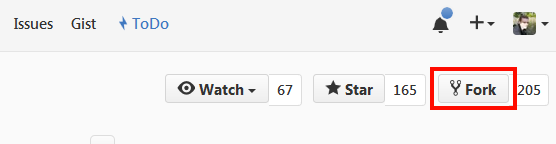

# 学习链码

本教程可以指导你着手为 Hyperledger 编写智能合约。

# 部署

为了实现对 Hyperledger fabric 多个版本的支持，本仓库使用了与 gopkg.in URLs 结合的分支。对于初学者这意味着什么呢？随便选择下面的一个分支，使用分支中的指导说明就可以完成本教程。

## 支持的平台和版本

- [v1.0](https://github.com/ibm-blockchain/learn-chaincode/tree/v1.0)
    - Hyperledger fabric v0.5-developer-preview
    - IBM Bluemix Blockchain Service v0.4.2
- [v2.0](https://github.com/ibm-blockchain/learn-chaincode/tree/v2.0)
    - Hyperledger fabric v0.6-developer-preview
    
如果你不想完整地学习本教程只打算部署这里的示例代码，你可以在使用 fabric REST API 部署链码的时候把 `path` 参数设置为下面的 URLs。URL 的选择对应于你上面选择的分支。

```
http://gopkg.in/ibm-blockchain/learn-chaincode.v1/finished
OR
http://gopkg.in/ibm-blockchain/learn-chaincode.v2/finished
```

# 如何编写链码

本教程演示了构建 [Hyperledger fabric](https://gerrit.hyperledger.org/r/#/admin/projects/fabric) 链码应用程序所需的基本构建块和函数。你将逐步创建一个可以用于通用资产的链码。然后，你可以使用网络 API 与链码交互。阅读并完成本教程后，你应该能够明确回答以下问题：

- 什么是链码？
- 如何实现链码？
- 实现链码需要什么依赖关系？
- 链码的主要功能是什么？
- 如何编译我的链码？
- 如何传递不同的值到我的参数？
- 如何安全地在我的网络上注册用户？
- 如何使用 REST API 与我的链码交互？

## 什么是链码？

链码是一段代码，它被部署到 [Hyperledger fabric](https://gerrit.hyperledger.org/r/#/admin/projects/fabric) 节点的网络中，实现与该网络的共享总账的交互。

--------------------------------------------------------------------------------

# 实现你的第一个链码

## 配置你的开发环境

在你开始之前，你应该访问 [这里](docs/setup.md) 构建你的链码开发环境。 当你再次回到这里的时候，你将拥有完成本教程所需的所有工具。

## 设置你的开发管道（Pipeline）

以下任务带你完成构建管道的过程，这能够让你有效地构建链码。 简而言之，用于链码迭代的管道包括以下步骤：

  - 更改本地上给定的链码，并检查代码是否能够编译。
  - 把你的更新推送到 Github。
  - 使用 fabric REST API 把更新的链码部署到本地 Hyperledger 网络中。
  - 使用 fabric REST API 测试你的链码。
  - 重复该过程。

1. 创建本仓库的分支到你的 Github 账户中。该操作可以通过点击本仓库顶部的 __Fork__ 按钮快速完成。

  

  对本仓库“创建分支”（Forking）意味着在你的 Github 账户中创建了一份本仓库的副本。请注意，Fork 操作将创建包括所有分支的整个仓库。切换左侧的 __Branch__ 按钮查看可用的分支。

  

2. 克隆你的分支到 $GOPATH 目录中。

  ```bash
  cd $GOPATH
  mkdir -p src/github.com/<YOUR_GITHUB_ID_HERE>/
  cd src/github.com/<YOUR_GITHUB_ID_HERE>/
  git clone -b v1.0 https://github.com/<YOUR_GITHUB_ID_HERE>/learn-chaincode.git
  OR
  git clone -b v2.0 https://github.com/<YOUR_GITHUB_ID_HERE>/learn-chaincode.git
  ```

  现在，你的电脑中已经有了你的分支的一个副本。你需要通过对这些本地文件的修改去开发你的链码，然后把它们推送到你的 Github 分支中，之后在你的一个节点上通过 REST API 把这些代码部署到你的区块链网络中。

3. 请注意，在本教程中，我们提供了两个不同版本的链码：[Start](start/chaincode_start.go) - 你将要在此基础上进行开发的框架链码，[Finished](finished/chaincode_finished.go) - 已完成的链码。

4. 确保它能够在你的本地环境中编译：

  - 打开终端或命令提示符

  ```bash
  cd $GOPATH/src/github.com/<YOUR_GITHUB_ID_HERE>/learn-chaincode/start
  go build ./
  ```

  - 编译的时候应该不会出现错误或文本。如果出现问题，请确保你已按照 [开发环境配置说明](docs/setup.md) 正确安装了 Go。

5. 把这些改变推送到你的 Github 分支中。

  ```bash
  cd $GOPATH/src/github.com/<YOUR_GITHUB_ID_HERE>/learn-chaincode/
  # 查看本地那些文件修改了。你应该能看到 chaincode_start.go
  git status
  # 暂存本地仓库中的所有更改以便进行提交
  git add --all
  # 提交所有暂存的更改。在 -m 参数后插入简短的描述
  git commit -m "Compiled my code"
  # 把本地的提交推送到 https://github.com/<YOUR_GITHUB_ID_HERE>/learn-chaincode/
  git push
  ```

为了把一段 Go 代码转换为链码，你所需要做的就是实现链码的 shim 接口。你必须实现的三个函数分别是 **Init**、**Invoke** 和 **Query**。这三个函数都具有相同的原型；他们接受一个 `stub` ——用来读取和写入总账，一个函数名和一个字符串数组。这几个函数的主要区别在于它们何时被调用。本教程中，你将构建一个链码用来创建通用资产。

### 依赖

`import` 语句列出了成功构建链码的一些依赖关系。
- `fmt` - 包含用于调试/日志记录的 `Println`。
- `errors` - 标准 go 错误格式。
- `github.com/hyperledger/fabric/core/chaincode/shim` - 包含了链码接口和链码 stub 的定义，它们用来与总账进行交互。

### Init()

Init 在首次部署你的链码时被调用。顾名思义，此函数用于链码所需的所有初始化工作。在我们的示例中，我们使用 Init 函数设置总账一个键值对的初始状态。

在你的 `chaincode_start.go` 文件中，修改 `Init` 函数，以便将 `args` 参数中的第一个元素存储到键 “hello_world” 中。

```go
func (t *SimpleChaincode) Init(stub shim.ChaincodeStubInterface, function string, args []string) ([]byte, error) {
    if len(args) != 1 {
        return nil, errors.New("Incorrect number of arguments. Expecting 1")
    }

    err := stub.PutState("hello_world", []byte(args[0]))
    if err != nil {
        return nil, err
    }

    return nil, nil
}
```

这是通过 stub 的 `stub.PutState` 函数完成的。该函数将部署请求中发送的第一个参数解释为要存储在分类帐中的键 “hello_world” 下的值。 这个参数是从哪里来的，什么是部署请求？我们将在实现接口后再解释。如果发生错误，例如传入的参数数量错误，或者写入总账时发生错误，则此函数将返回错误。否则，它将完全退出，什么都不返回。

### Invoke()

当你想调用链码函数来做真正的工作时，`Invoke` 就会被调用。这些调用会被当做交易被分组到链上的区块中。当你需要更新总账时，就会通过调用你的链码去完成。`Invoke` 的结构很简单。它接收一个 `function` 以及一个数组参数，基于调用请求中传递的 `function` 参数所指的函数，`Invoke` 将调用这个辅助函数或者返回错误。

在你的 `chaincode_start.go` 文件中，修改 `Invoke` 函数，让它调用一个普通的 `write` 函数。

```go
func (t *SimpleChaincode) Invoke(stub shim.ChaincodeStubInterface, function string, args []string) ([]byte, error) {
    fmt.Println("invoke is running " + function)

    // 处理不同的函数
    if function == "init" {
        return t.Init(stub, "init", args)
    } else if function == "write" {
        return t.write(stub, args)
    }
    fmt.Println("invoke did not find func: " + function)

    return nil, errors.New("Received unknown function invocation: " + function)
}
```

现在，它正在寻找 `write` 函数，让我们把这个函数写入你的 `chaincode_start.go` 文件。

```go
func (t *SimpleChaincode) write(stub shim.ChaincodeStubInterface, args []string) ([]byte, error) {
    var key, value string
    var err error
    fmt.Println("running write()")

    if len(args) != 2 {
        return nil, errors.New("Incorrect number of arguments. Expecting 2. name of the key and value to set")
    }

    key = args[0]                            //rename for fun
    value = args[1]
    err = stub.PutState(key, []byte(value))  //把变量写入链码状态中
    if err != nil {
        return nil, err
    }
    return nil, nil
}
```

你可能会认为这个 `write` 函数看起来类似 `Init`。 它们确实很像。 这两个函数检查一定数量的参数，然后将一个键/值对写入总账。然而，你会注意到，`write` 函数使用两个参数，允许你同时传递给调用的 `PutState` 键和值。基本上，该函数允许你向区块链总账上存储任意你想要的键值对。

### Query()

顾名思义，无论何时查询链码状态，`Query` 都会被调用。查询操作不会导致区块被添加到链中。你不能在 `Query` 中使用类似 `PutState` 的函数，也不能使用它调用的任何辅助函数。你将使用 `Query` 读取链码状态中键/值对的值。

在你的 `chaincode_start.go` 文件中，修改 `Query` 函数，让它调用一个普通的 `read` 函数，类似你对 `Invoke` 函数的修改。

```go
func (t *SimpleChaincode) Query(stub shim.ChaincodeStubInterface, function string, args []string) ([]byte, error) {
    fmt.Println("query is running " + function)

    // 处理不同的函数
    if function == "read" {                            //读取变量
        return t.read(stub, args)
    }
    fmt.Println("query did not find func: " + function)

    return nil, errors.New("Received unknown function query: " + function)
}
```

现在，它正在寻找 `read` 函数，让我们在 `chaincode_start.go` 文件中创建该函数。

```go
func (t *SimpleChaincode) read(stub shim.ChaincodeStubInterface, args []string) ([]byte, error) {
    var key, jsonResp string
    var err error

    if len(args) != 1 {
        return nil, errors.New("Incorrect number of arguments. Expecting name of the key to query")
    }

    key = args[0]
    valAsbytes, err := stub.GetState(key)
    if err != nil {
        jsonResp = "{\"Error\":\"Failed to get state for " + key + "\"}"
        return nil, errors.New(jsonResp)
    }

    return valAsbytes, nil
}
```

这个 `read` 函数使用了与 `PutState` 作用相反的 `GetState`。 `PutState` 允许你对一个键/值对赋值，`GetState`允许你读取之前赋值的键的值。你可以看到，该函数使用的唯一参数被作为应该检索的值的键。接下来，此函数将字符数组返回到 `Query`，然后将它返回给 REST 句柄。

### Main()

最后，你需要创建一个简短的 `main` 函数，它在每个节点部署链码实例的时候执行。它仅仅调用了 `shim.Start()`，该函数会在链码与部署链码的节点之间建立通信。你不需要为该函数添加任何代码。`chaincode_start.go` 和 `chaincode_finished.go` 都有一个 `main` 函数，它位于文件的顶部。该函数如下所示：

```go
func main() {
    err := shim.Start(new(SimpleChaincode))
    if err != nil {
        fmt.Printf("Error starting Simple chaincode: %s", err)
    }
}
```

### 需要帮助？

如果你在任何时候被卡住或有什么困惑，只需去查看 `chaincode_finished.go` 文件。使用该文件检查您正在编写的 `chaincode_start.go` 代码段是否正确。

# 与你的第一个链码交互

测试你的链码的最快方法是使用节点上的 REST 接口。如果你使用的是 Bluemix 上的块链服务，你应该依照 [这里](https://new-console.ng.bluemix.net/docs/services/blockchain/ibmblockchain_tutorials.html) 描述的步骤（否则，我们建议使用 [环境配置文档](docs/setup.md) 中所述类似 Postman 的工具）。我们需要与两个 REST 端点交互：`/chaincode` 和 `/registrar`。

  - `/chaincode` 是用于部署、调用和查询链码的端点。执行哪种操作由发送的请求 Body 内容来控制。
  - `/registrar` 允许你注册用户。为什么这么重要？请继续阅读！

### 安全注册

调用 REST 接口的 `/chaincode` 端点需要在请求的 Body 中包含一个安全上下文 ID。这意味着你必须先在网络成员服务的用户列表中注册一个用户。在你的节点中查找一个可用的用户去注册。这很可能需要为你的网络从 [membersrvc.yaml](fabric/membersrvc/membersrvc.yaml) 文件中抓取一个用户。找到包含以下用户列表的部分：

  ```
  ...
  test_user0: 1 MS9qrN8hFjlE bank_a        00001
  test_user1: 1 jGlNl6ImkuDo institution_a 00007
  test_user2: 1 zMflqOKezFiA bank_c        00008
  ...
  ```

- 打开记事本并复制一组凭证，接下来会用到它们。

  ```
  test_user0 MS9qrN8hFjlE
  ```

- 如下所示，创建一个 POST 请求。

  

  该 URL 表示 Bluemix 某个节点的 REST 端口可以通过 `b88037dd5b6d423caf5258c6b7b15f5a-vp3.dev.blockchain.ibm.com:443` 访问。这是 vp3 节点的 api URL。你可以在区块链仪表盘 **服务凭据（Service Credentials）** 选项卡上找到该信息，或者在 Bluemix 控制台的 __网络__ 选项卡中。这个特定的注册会被发送到 vp3 节点，不过，它能够被转发到所有的网络节点上。

- 该请求的 Body 内容为：

  ```json
  {
    "enrollId": "<YOUR_USER_HERE>",
    "enrollSecret": "<YOUR_SECRET_HERE>"
  }
  ```

- 发送这个请求。如果一切顺利，你会看到类似下面的响应：

  

  如果你没有收到“登录成功”的响应，请返回并确保你已正确复制了注册 ID 和密码。现在，你有了一个 ID，它用于后续步骤中链码的部署、调用和查询。

### 部署链码

为了通过 REST 接口部署链码，你需要将链码存储在公共的 git 仓库中。当你向节点发送部署请求时，请求中包括你的链码仓库 URL 以及初始化链码所需的参数。

**在部署链码之前**，确保它能在本地构建！

- 打开终端或命令提示符

- 进入包含 `chaincode_start.go` 的文件夹，编译你的链码：

  ```bash
    cd $GOPATH/src/github.com/<YOUR_GITHUB_ID_HERE>/learn-chaincode/start
    go build ./
  ```

- 如果没有出现错误/文本，这意味着你的链码已经编译成功了。这是个好兆头。

- 如下所示，创建一个 POST 请求。

  

- **注意**：确保你部署到的节点与用户注册到的节点是相同的。在这里我们使用的是 vp3 节点。

- 该请求的 Body 内容为：

  ```json
  {
    "jsonrpc": "2.0",
    "method": "deploy",
    "params": {
      "type": 1,
      "chaincodeID": {
        "path": "https://github.com/<YOUR_GITHUB_ID_HERE>/learn-chaincode/finished"
      },
      "ctorMsg": {
        "function": "init",
        "args": [
          "hi there"
        ]
      },
      "secureContext": "<YOUR_USER_HERE>"
    },
    "id": 1
  }
  ```

- `"path"`：你创建的 Github 仓库分支的路径，`chaincode_finished.go` 文件在它的下一级目录 `/finished` 中。

- 发送该请求。如果一切顺利，你会看到类似下面的响应：

  
  
部署响应的一长串字符串中包含了一个与链码相关的 ID。这个 ID 是一个由 128 个字母数字组成的哈希。可以在记事本上复制该 ID。现在，你应该有一组 enrollID 凭据和标识你的链码的加密哈希了。这就是在接下来调用或查询交易中如何引用链码的方式。

### 查询

接下来，让我们查询链码中 `hello_world` 键的值，之前我们使用了 `Init` 函数为它设置了初始值。

- 如下所示，创建一个 POST 请求。

  

- 该请求的 Body 内容为:

  ```json
  {
    "jsonrpc": "2.0",
    "method": "query",
    "params": {
      "type": 1,
      "chaincodeID": {
        "name": "<CHAINCODE_HASH_HERE>"
      },
      "ctorMsg": {
        "function": "read",
        "args": [
          "hello_world"
        ]
      },
      "secureContext": "<YOUR_USER_HERE>"
    },
    "id": 2
  }
  ```

- 发送该请求。如果一切顺利，你会看到类似下面的响应：

  

该值是由之前部署请求的 Body 设置的。

### 调用

接下来，通过调用在链码中编写的普通 `write` 函数，将 “hello_world” 的值改为 “go away”。

- 如下所示，创建一个 POST 请求。

  

- 该请求的 Body 内容为:

  ```json
  {
    "jsonrpc": "2.0",
    "method": "invoke",
    "params": {
      "type": 1,
      "chaincodeID": {
        "name": "<CHAINCODE_HASH_HERE>"
      },
      "ctorMsg": {
        "function": "write",
        "args": [
          "hello_world", "go away"
        ]
      },
      "secureContext": "<YOUR_USER_HERE>"
    },
    "id": 3
  }
  ```

- 发送该请求。如果一切顺利，你会看到类似下面的响应：
  
  

- 可以通过发送一个类似之前的查询操作，测试我们的更改是否成功。

  

这就是编写基本链码所需要的全部内容。